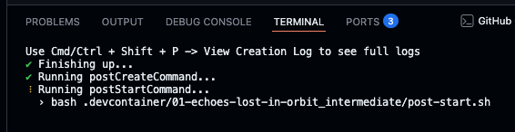
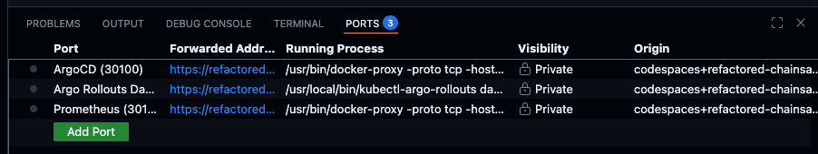

# 🟡 Intermediate: The Silent Canary

After fixing the communication outage in Level 1, the Intergalactic Union welcomed a new species: the **Zephyrians** 🌟

The communications team attempted to deploy their language files using a progressive delivery system, but the rollout is
failing. The Zephyrians are still waiting to communicate with the rest of the galaxy.

A previous engineer configured automated canary deployments with health checks but left the setup incomplete. Your
mission: debug the broken rollout and bring the Zephyrians' voices online.

## ⏰ Deadline

Wednesday, 24 December 2025 at 09:00 CET
> ℹ️ You can still complete the challenge after this date, but points will only be awarded for submissions before the
> deadline.

## 💬 Join the discussion

Share your solutions and questions in
the [challenge thread](TODO)
in the Open Ecosystem Community.

## 🎯 Objective

By the end of this level, you should have:

- Pod info **version 6.9.3** deployed successfully in both **staging** and **production** environments
- Rollouts **automatically progress** through canary stages based on health metrics
- Two **working PromQL queries** in the `AnalysisTemplate` that validate application health during releases
- All rollouts complete successfully

## 🧠 What You'll Learn

- How to write PromQL queries to monitor application health
- How progressive delivery reduces deployment risk with automated validation
- How to debug and fix broken canary deployments
- How [Argo Rollouts](https://argoproj.github.io/rollouts/) and [Prometheus](https://prometheus.io/) work together to
  make data-driven deployment decisions

## 🧰 Toolbox

Your Codespace comes pre-configured with the following tools to help you solve the challenge:

- [`kubectl`](https://kubernetes.io/docs/reference/kubectl/): The Kubernetes command-line tool for interacting with the
  cluster
- [`kubens`](https://github.com/ahmetb/kubectx): Fast way to switch between Kubernetes namespaces
- [`k9s`](https://k9scli.io/): A terminal-based UI to interact with your Kubernetes clusters
- [Argo CD CLI](https://argo-cd.readthedocs.io/en/latest/user-guide/commands/argocd/): Manage Argo CD applications from
  the command line
- [Argo Rollouts kubectl plugin](https://argo-rollouts.readthedocs.io/en/stable/features/kubectl-plugin/): Extended
  kubectl commands for managing Argo rollouts

## ✅ How to Play

### 1. Start Your Challenge

> 📖 **First time?** Check out the [Getting Started Guide](../../start-a-challenge.md) for detailed instructions on
> forking, starting a Codespace, and waiting for infrastructure setup.

Quick start:

- Fork the repo
- Create a Codespace
- Select "Adventure 01 | 🟡 Intermediate (The Silent Canary)"
- Wait ~5-10 minutes for all infrastructure to deploy (`Cmd/Ctrl + Shift + P` → `View Creation Log` to view progress)

> ⚠️ After the infrastructure deploys, the setup script automatically starts port
> forwarding to the Argo Rollouts dashboard. This keeps the terminal busy, which is expected behavior. Your environment
> is fully ready when you see the terminal output shown below. Just open a new terminal to run commands.



### 2. Access the UIs

- Open the **Ports** tab in the bottom panel to access the following UIs
  

> 💡 **Not a fan of user interfaces?** No problem, you can also use the CLI tools to complete the challenge. But if
> you're new(ish) to these tools, the UIs can help you get familiar faster.

#### Argo CD (Port 30100)

The Argo CD UI shows the sync status of your applications and allows you to refresh them after pushing new commits.

- Find the Argo CD row (port 30100) and click the forwarded address
- Log in using:
  ```
  Username: readonly
  Password: a-super-secure-password
  ```

#### Argo Rollouts (Port 30101)

The Argo Rollouts dashboard shows canary deployment progress and analysis status.

- Find the Argo Rollouts row (port 30101) and click the forwarded address

#### Prometheus (Port 30102)

The Prometheus UI helps you explore available metrics and test your PromQL queries.

- Find the Prometheus row (port 30102) and click the forwarded address

### 3. Fix the Configuration

The Zephyrians are waiting for their language pack, but there are misconfigurations preventing the rollout from
completing successfully. Your task is to investigate, identify, and fix the issues.

Review the [🎯 Objective](#objective) section to understand what a successful solution looks like. The [Argo Rollouts
dashboard](#argo-rollouts-port-30101) and [Prometheus UI](#prometheus-port-30102) can help you debug and validate your
changes.

#### Where to Look

All manifests are located in:

```
adventures/01-echoes-lost-in-orbit/intermediate/manifests/
```

> 📦 **About Kustomize:** This challenge uses [Kustomize](https://kustomize.io/) under the hood to manage Kubernetes
> manifests. Kustomize allows us to maintain a **base** set of manifests and apply environment-specific customizations
> through **overlays** (staging, prod). Each overlay can modify the base configuration—like changing replica counts or
> namespaces—without duplicating YAML. With the `ApplicationSet`, Argo CD automatically detects and applies these
> Kustomize configurations, so you don't need to run Kustomize commands manually.

#### Deploy Your Changes

After making your fixes, commit and push them to trigger the deployment:

```bash
git add adventures/01-echoes-lost-in-orbit/intermediate/manifests/
git commit -m "Fix rollout configuration"
git push
```

> 💡 **Tip:** If you're pushing to a branch other than `main`, make sure to also update the `ApplicationSet` in
> `adventures/01-echoes-lost-in-orbit/intermediate/manifests/appset.yaml` to point to your branch.

Argo CD will automatically sync your changes after some time. You can speed things up by refreshing the applications
manually:

```bash
argocd app get echo-server-staging --refresh
argocd app get echo-server-prod --refresh
```

After ArgoCD syncs your changes, trigger the rollout:

```bash
kubectl argo rollouts retry rollout echo-server -n echo-staging
kubectl argo rollouts retry rollout echo-server -n echo-prod
```

#### Monitor the Rollout

Watch the canary deployment progress in the [Argo Rollouts dashboard](#argo-rollouts-port-30101) or use the CLI:

```bash
kubectl argo rollouts get rollout echo-server -n echo-staging --watch
kubectl argo rollouts get rollout echo-server -n echo-prod --watch
```

The rollout should automatically progress through the canary stages (33% → 66% → 100%).

> ℹ️ **Note:** In real-world progressive delivery, updates are typically deployed to staging first, validated, and then
> promoted to production. For this challenge, both environments update simultaneously to simplify the workflow and focus
> on learning canary rollouts and health checks.

#### Helpful Documentation

- [Argo Rollouts](https://argo-rollouts.readthedocs.io/en/stable/)
- [Analysis and Progressive Delivery](https://argo-rollouts.readthedocs.io/en/stable/features/analysis/)
- [PromQL Basics](https://prometheus.io/docs/prometheus/latest/querying/basics/)
- [Kubernetes Metrics](https://github.com/kubernetes/kube-state-metrics/tree/main/docs#exposed-metrics) exported by
  kube-state-metrics

### 4. Verify Your Solution

Once you think you've solved the challenge, it's time to verify!

#### Run the Smoke Test

Run the provided smoke test script from the repo root:

```bash
adventures/01-echoes-lost-in-orbit/intermediate/smoke-test.sh
```

If the test passes, your solution is very likely correct! 🎉

#### Complete Full Verification

For comprehensive validation and to officially claim completion:

1. **Commit and push your changes** to your fork
2. **Manually trigger the verification workflow** on GitHub Actions
3. **Share your success** with the [community](TODO)

> 📖 **Need detailed verification instructions?** Check out the [Verification Guide](../../verification.md) for
> step-by-step instructions on both smoke tests and GitHub Actions workflows.
