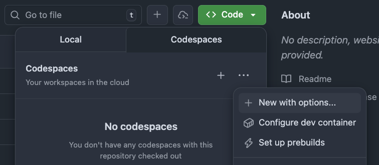
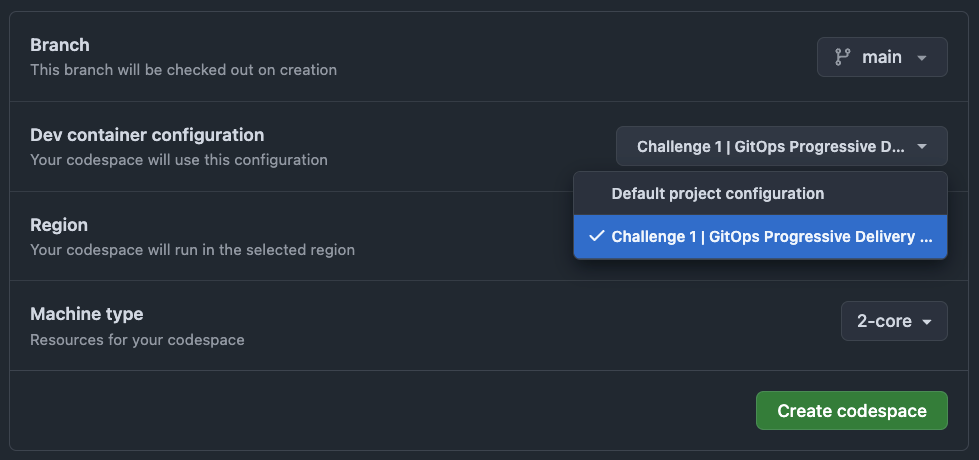
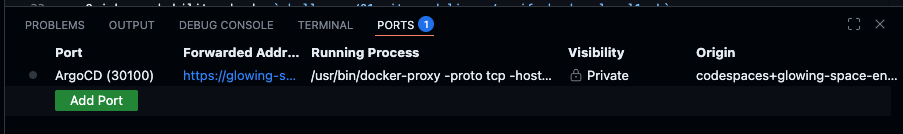

# Level 1: The Echo Distortion

The Echo Server is misbehaving. Both environments seem to be down, and messages are silent. Your mission: investigate
the ArgoCD configuration and restore proper multi-environment delivery.

## 🎯 Objective

By the end of this level, you should:

- See **two distinct Applications** in the Argo CD dashboard (one per environment)
- Ensure each Application deploys to its **own isolated namespace**
- **Make the system resilient** so changes from outside Git cannot break it
- Confirm that **updates flow automatically** without leaving stale resources behind

## 🧠 What You’ll Learn

- How Argo CD ApplicationSets work
- How to reason about templating and sync policies
- How drift detection and self-healing operate in GitOps workflows

## ✅ How to Play

1. **Fork the Repository**
    - Click the “Fork” button in the top-right corner of the GitHub repo or use this
      link: [Fork the repo](https://github.com/KatharinaSem-challenges/fork)

2. **Start a Codespace**
    - From your fork, click the green **Code** button → **Codespaces hamburger menu** → **New with options**.
      
    - Select the **Challenge 1** configuration.
      
   > ⚠️ **Important:** The challenge will not work if you choose another configuration (or the default).

3. **Wait for Infrastructure to Deploy**
    - Your Codespace will automatically provision a Kubernetes cluster, Argo CD, and the sample app. This usually takes
      around 5 minutes.
    - To check the progress press `Cmd + Shift + P` (or `Ctrl + Shift + P` on Windows/Linux) and search for
      `View Creation Log`

4. **Access the Argo CD Dashboard**
    - Open the **Ports** tab in the bottom panel to find the Argo CD row (port `30100`) and click on the forwarded address.
      
    - Log in using:
      ```
      Username: readonly
      Password: a-super-secure-password
      ```

5. **Fix the Configuration**
    - All errors are located in [this ApplicationSet](/challenges/01-gitops-delivery/manifests/appset.yaml):
      ```
      challenges/01-gitops-delivery/manifests/appset.yaml
      ```
    - Learn more about ApplicationSets:  
      https://argo-cd.readthedocs.io/en/stable/operator-manual/applicationset/
    - After making changes, apply them:
      ```
      kubectl apply -n argocd -f challenges/01-gitops-delivery/manifests/appset.yaml
      ```
      (Run from the repo root)

6. **Run the Smoke Test**
    - Once you think the challenge is solved, run the provided smoke test script:
      ```
      ./challenges/01-gitops-delivery/tests/smoke-test.sh
      ```
      (Run from the repo root)
    - If the test passes, your solution is very likely correct for Level 1.

7. **Submit Your Completion**
    - Push your changes to `main` to trigger the full verification workflow. 
   > 🚧 TODO will probably be a manual trigger where the user can select the level or smth like that
    - This workflow performs deeper checks that the smoke test cannot do (without revealing solutions).
    - If the workflow succeeds, post a screenshot of the result in the challenge thread on the Open Ecosystem to claim
      completion.

---

Not sure which tools are available? Check out your [Toolbox](index.md#toolbox) for useful utilities.